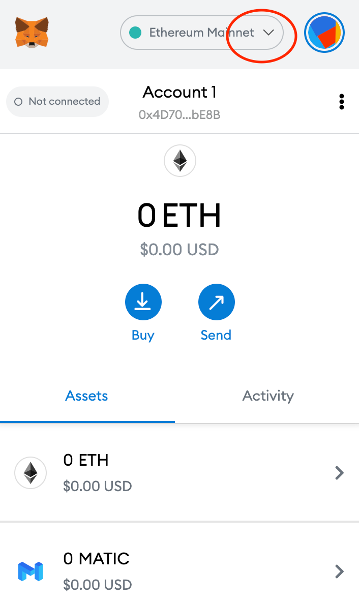
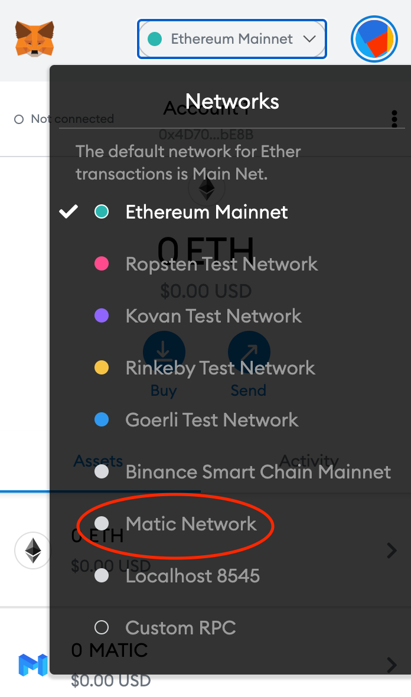
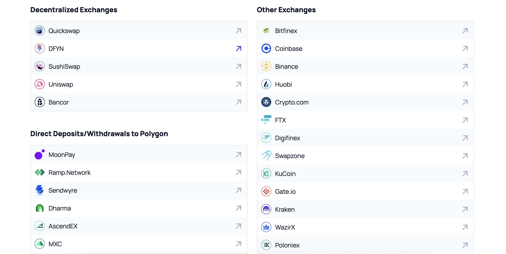
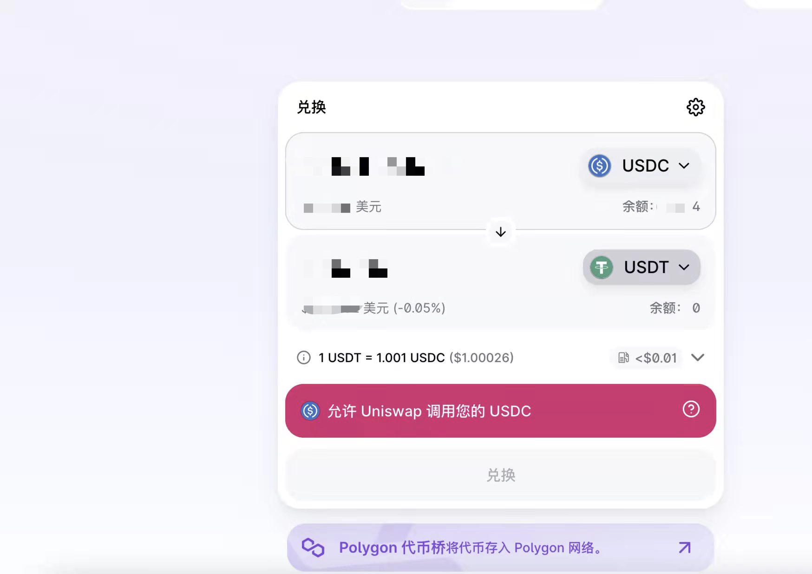

# How to get USDC out of the Matic network?

Step 1 ：where can I use the **Matic Web Wallet**?



Step 2: Open your **Metamask wallet** and click on the network dropdown to expand as shown in figure

Once the window expands you can select **Polygon Network** to switch.

Step 3: Read your **USDC balance**

3.1 **** If you decide to keep USDC in the wallet on the Polygon network, do nothing.

3.2 To **transfer from the wallet**, first swap **a little MATIC token (5-10 cents)** using your USDC you just received via their gas-less swap feature.

step 4: If you want to **transfer USDC to an exchange**, you can only sent via the Polygon network to **crypto.com**, **OKEx** or **Binance** etc. **You will lose your USDC if you try to transfer them to any other exchange! Do NOT do it!**

step 5: You can also **connect your wallet to Uniswap** through their Polygon layer to swap USDC to any coins you want.

<mark style="color:red;">Note:  1) bridge back, expensive, not very smart; 2) on the exchange, I am sure you can choose to change network off-chain and no cost For most people, there's NO need to bridge back to Ethereum network.</mark>

