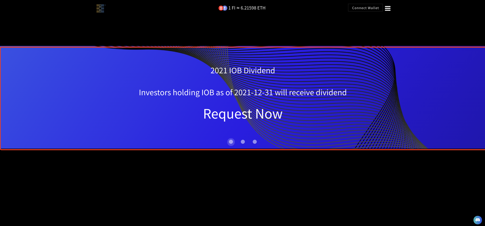
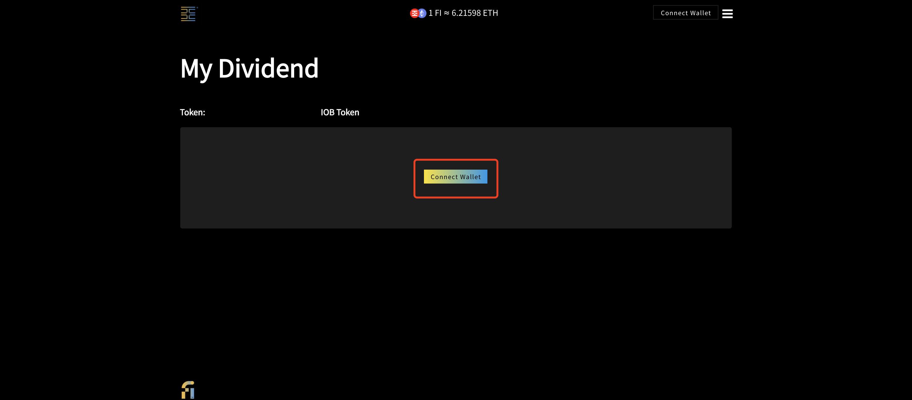
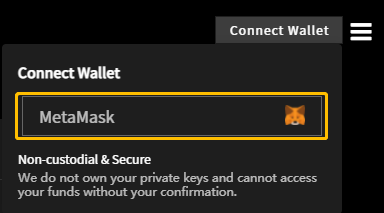
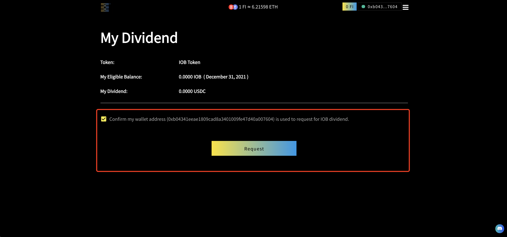

# How to request 2021 IOB Dividend?

### **Open **<mark style="color:red;">****</mark> [<mark style="color:red;">**iob.fi**</mark>](https://iob.fi) **homepage**

Step 1: Find the **banner** on the [iob.fi](https://iob.fi) homepage and click.&#x20;

Step 2: Click the **"Connect Wallet"** button.

In **“Connect Wallet”** window，select a wallet (currently **“MetaMask”** and more selection under development)

step 3:  Confirm my wallet address (0xb04......0076) is used to request for IOB dividend. Click the **"Request"** button.

step 4:  **"Requested!"**&#x20;

.jpg>)

