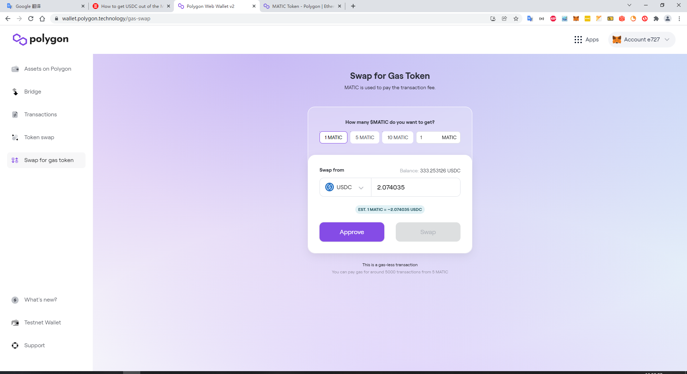

# How to get USDC out of the Matic network?

Step 1: Add **** [**Polygon Network on MetaMask**](https://docs.polygon.technology/docs/develop/metamask/config-polygon-on-metamask/)****

Step 2: Read your **USDC balance** on **** [**Polygon Wallet**](https://wallet.polygon.technology)****

&#x20; 2.1 **** If you decide to keep USDC in the wallet on the Polygon network, do nothing.

&#x20; 2.2 To **transfer from the wallet**, first swap **a little MATIC token (5-10 cents)** using your USDC you just received via their [**gas-less swap**](https://wallet.polygon.technology/gas-swap) feature.

Step 3: If you want to **transfer USDC to an** [**exchange**](https://docs.polygon.technology/docs/faq/wallet-bridge-faq/#what-are-the-list-of-supported-exchanges-on-polygon), you can only sent via the Polygon network to **crypto.com**, **OKEx** or **Binance** etc. **You will lose your USDC if you try to transfer them to any other exchange! Do NOT do it!**

Step 4:You can also **connect your wallet to Uniswap** through their Polygon layer to swap USDC to any coins you want.

<mark style="color:red;">Note:</mark> &#x20;

&#x20; <mark style="color:red;">1. bridge back, expensive, not very smart;</mark>

&#x20; <mark style="color:red;">2. on the exchange, I am sure you can choose to change network off-chain and no cost For most people, there's NO need to bridge back to Ethereum network.</mark>

