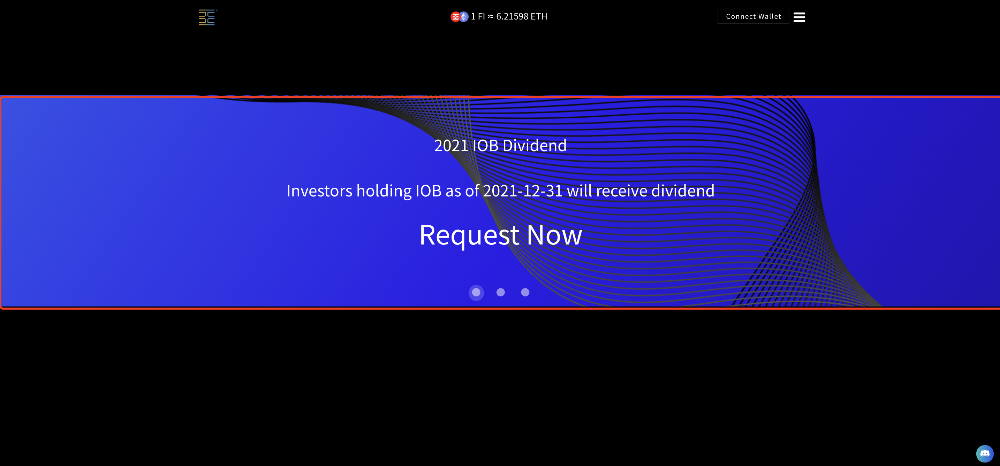
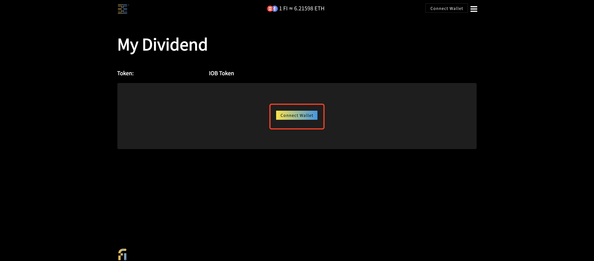
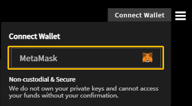
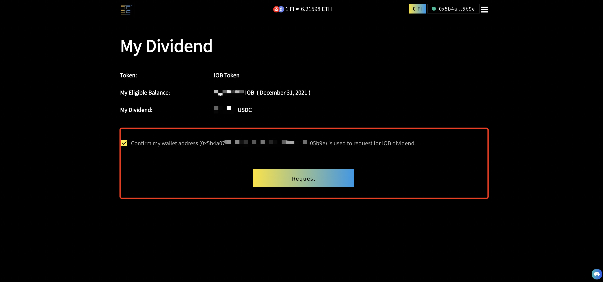
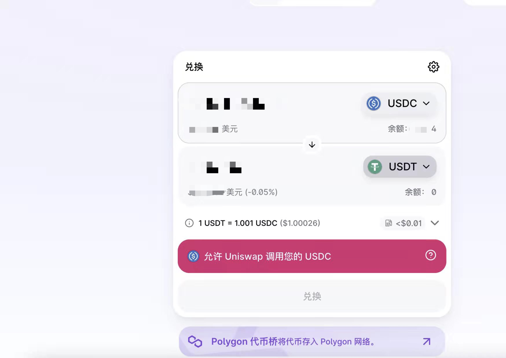

# Requesting and Accessing 2021 IOB Dividend

## 1. Requesting

### Step 1:&#x20;

On [iob.fi](https://iob.fi) homepage, click "2021 IOB Dividend" button. You can also click on the banner shown below. (Click [https://iob.fi/dividend/0x6130ff302f24267380753e52ece48b852be3dd38](https://iob.fi/dividend/0x6130ff302f24267380753e52ece48b852be3dd38) to skip to step 2.)

or

### Step 2:&#x20;

Click the **"Connect Wallet"** button.

In **“Connect Wallet”** window，select a wallet (currently **“MetaMask”** and more selection under development)

### Step 3: &#x20;

Confirm my wallet address (0x5b4......5b9e) is used to request for IOB dividend. Click the **"Request"** button.

### Step 4: &#x20;

**"Requested!"**&#x20;

.jpg>)

#### **Note: Once you have requested your dividend, your eligible dividend will be reset to "0"**

## **2. Accessing Your Dividend on Polygon Network**

### Step 1:&#x20;

Add **** [**Polygon Network on MetaMask**](https://docs.polygon.technology/docs/develop/metamask/config-polygon-on-metamask/)****

****

### Step 2:&#x20;

Check and confirm your **USDC balance** on **** [**Polygon Wallet**](https://wallet.polygon.technology)

.png>)

2.1 If you decide to keep USDC in the wallet on the Polygon network, do nothing.

2.2 To transfer from the wallet, first swap a little MATIC token (5-10 cents) using your USDC you just received via their gas-less swap feature.

.png>)

2.2.1 If you want to **transfer USDC to an** [**exchange**](https://docs.polygon.technology/docs/faq/wallet-bridge-faq/#what-are-the-list-of-supported-exchanges-on-polygon), you can only sent via the Polygon network to **one of the following: crypto.com**, **OKEx** or **Binance**. **You will lose your USDC if you try to transfer them to any other exchange! Do NOT do it! If unsure, please ask in our** [**Telegram**](https://t.me/+Swx7dK5JMJfBcXBm) **group first!**

### Step 3:

You can also **connect your wallet to Uniswap** through their Polygon layer to swap USDC to any coins you want.

<mark style="color:red;">Remember, the USDC is in your wallet on the Polygon Network. You do not need to "get it out." It is already there, as long as you have the private key to your wallet.</mark>&#x20;
